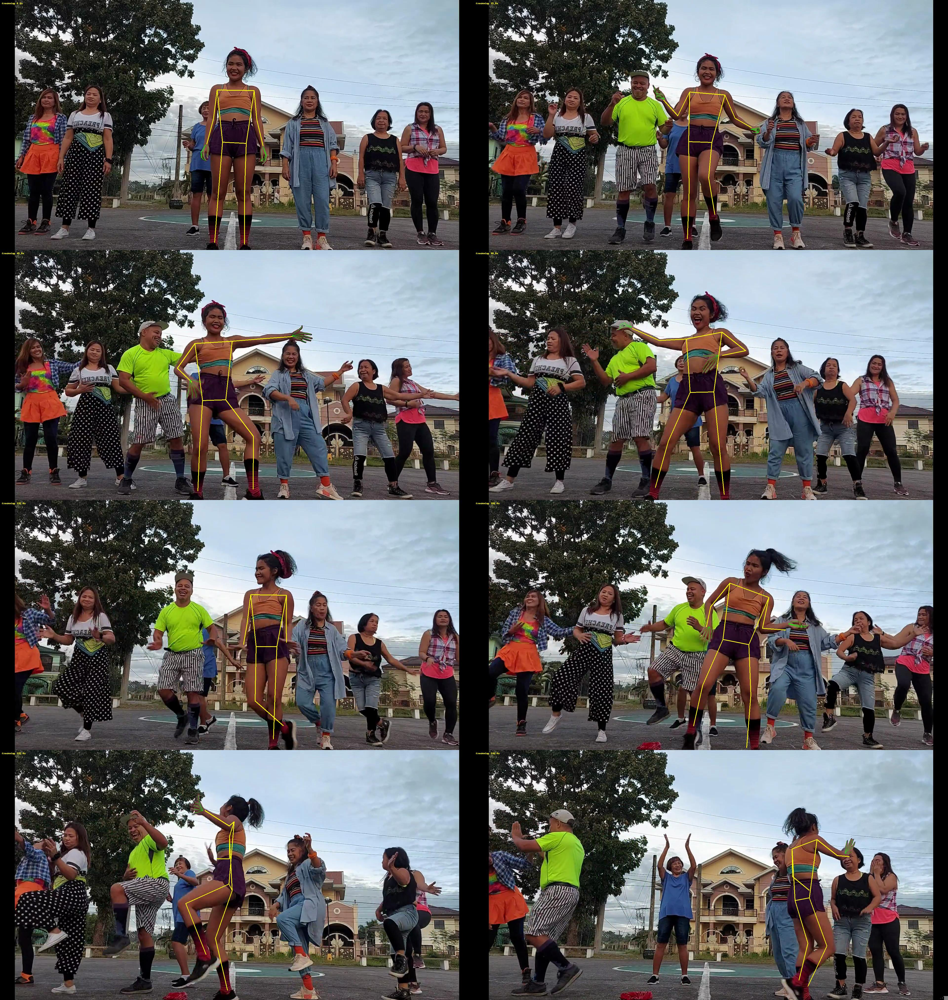

PLAY WITH ME!

## Give it up 안무

동작 선택 메뉴의 **Give it up 안무 (전체 곡)** 으로 가운데 앞줄 여성의
전체 안무를 재생합니다. 세 모델 모두 지원하며, 한 번 재생한 뒤 대기
동작으로 돌아갑니다. 선택하면 원본 YouTube 임베드로 음악을 함께 재생합니다.
영상 또는 Hero 진행 막대에서 재생 위치를 바꾸면 안무도 같은 시점으로 이동하며,
일시정지·버퍼링 중에는 영상의 현재 시점에 안무가 멈춥니다. 모델을 바꿔도
영상의 현재 시점부터 이어집니다. 다른 동작을 선택하거나 플레이어를 닫으면 음악도 멈춥니다.
브라우저에서 자동 재생을 차단하면 재생 버튼을 눌러 시작할 수 있습니다.

- 원본: [Give it up - Super energetic choreography](https://www.youtube.com/watch?v=uup-nmXhsHQ), Zin Andy and Daddy G.
- 입력 해상도: 1920×1012.
- 전체 영상 길이: 245.267초. 원본의 모든 프레임을 30fps로 추출하고 재생 시 사이를 보간합니다.
- 추출: [FreeMoCap](https://github.com/freemocap/freemocap) 1.8.2, 로컬 처리.
- FreeMoCap의 SkellyTracker Holistic Heavy로 관절을 새로 검출하고,
  단일 카메라 처리 및 SkellyForge의 선형 보간·4Hz Butterworth 필터를 적용합니다.
- 기존 MediaPipe 추출기는 대상 인물의 위치를 찾는 보조 단계로 사용합니다.
  해당 관절을 복사하지 않고 인물의 크롭 범위만 FreeMoCap에 전달합니다.
- 각 모델의 뼈대 기준 자세에 맞춘 애니메이션은 `public/animations/`에 있습니다.
- 첫 자세의 상체 방향을 모델의 기준 자세에 맞춰 촬영 시점에 섞인 기울기를
  제거합니다. 모델의 다리 뼈 길이는 유지하고 이후 안무의 상대적인 기울기를 적용합니다.
- 단일 카메라에서 추정한 움직임입니다. 낮은 해상도, 가림, 화면 밖 발끝으로 인해
  깊이와 발 접촉에 오차가 있습니다. 양손의 21개 지점으로 손가락 굽힘과 벌어짐을
  추출하며, 각 손가락의 세 관절을 재생합니다. 표정은 추출하지 않습니다.
- 신뢰할 수 있는 손 검출 비율은 왼손 약 68.5%, 오른손 약 50.2%입니다.
  검출하지 못한 구간은 앞뒤의 검출된 손 모양 사이를 시간에 따라 보간합니다.
  손바닥 기준의 손가락 방향을 구면 보간하며, 시작·끝의 누락은 가장 가까운 손 모양을 유지합니다.
  긴 가림 구간도 보간하므로 해당 구간의 실제 손가락 동작과 다를 수 있습니다.

### 다시 추출하기

uv로 Python 3.13(대상 선택)과 Python 3.11(FreeMoCap) 환경을 각각 구성합니다.
입력은 `public/choreography/give-it-up.mp4`입니다. 학습 모델과 중간 관절 배열은
저장소에 포함하지 않습니다.
[Google 공식 모델](https://storage.googleapis.com/mediapipe-models/pose_landmarker/pose_landmarker_heavy/float16/1/pose_landmarker_heavy.task)을
다운로드한 뒤 실행합니다.

```sh
uv venv --python 3.13 /tmp/give-it-up-guide-venv
uv pip install --python /tmp/give-it-up-guide-venv/bin/python -r scripts/dance-requirements.txt
uv run --no-project --python /tmp/give-it-up-guide-venv/bin/python scripts/extract-dance.py public/choreography/give-it-up.mp4 \
  --model /path/to/pose_landmarker_heavy.task \
  --fps 30 \
  --output /tmp/give-it-up-guide

uv venv --python 3.11 /tmp/give-it-up-freemocap-venv
uv pip install --python /tmp/give-it-up-freemocap-venv/bin/python -r scripts/freemocap-requirements.txt
uv run --no-project --python /tmp/give-it-up-freemocap-venv/bin/python scripts/extract-freemocap-dance.py public/choreography/give-it-up.mp4 \
  --guide /tmp/give-it-up-guide/poses.json \
  --fps 30 \
  --output /tmp/give-it-up-freemocap
node scripts/retarget-dance.mjs /tmp/give-it-up-freemocap/poses.json public/animations
```

추출 결과의 `tracking-preview.jpg`에서 가운데 여성을 추적했는지 확인하고,
`report.json`에서 누락 비율을 확인합니다. `--seconds 20`으로 짧은 구간을
먼저 시험할 수 있습니다. FreeMoCap 단계의 가이드는 처리할 구간 전체를 포함해야 합니다.
두 추출기의 기본값은 `--fps 30`입니다. 기존 15fps 위치 가이드도 크롭 안내로
재사용할 수 있으며, FreeMoCap은 지정한 프레임 간격으로 관절을 새로 검출합니다.
`--workers 3`이 기본값이며, 메모리가 부족하면 `--workers 1`을 사용합니다.
다른 영상에는 대상 선택 조건을 조정해야 합니다.

이번 영상의 [추적 검증 이미지](docs/give-it-up/tracking-preview.jpg)와
[추출 결과](docs/give-it-up/report.json)를 보관했습니다. 총 7,359개 시간 표본에서
마지막 종료 표본을 제외한 7,358프레임 중 인물 검출 누락은 6프레임(약 0.08%)입니다.
평균 관절 신뢰도는 0.793이며, 신뢰도가 낮은 개별 관절도 보간했습니다.
가장 긴 개별 관절 보간 구간은 약 7.3초입니다.
검출 누락 비율은 관절 추정 정확도를 의미하지 않습니다.
단일 영상이므로 카메라 보정·다중 시점 삼각측량은 적용하지 않았고, FreeMoCap의
단일 카메라 평면화 옵션을 끈 상대 깊이 추정값을 사용합니다.


